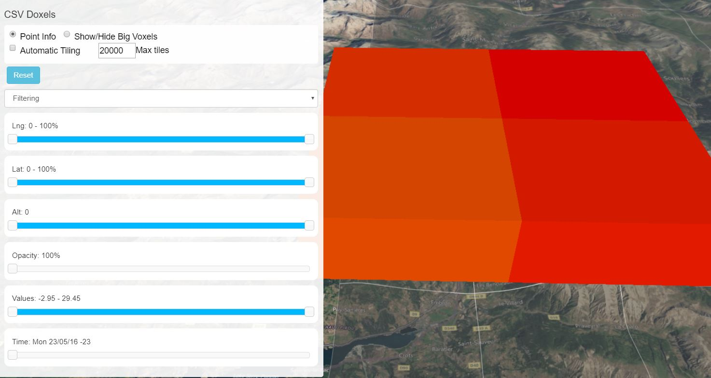
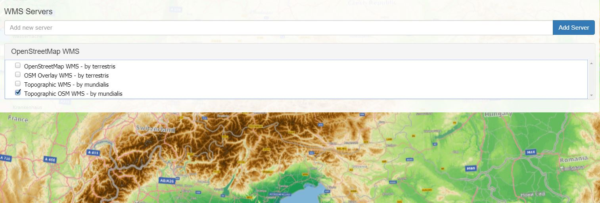
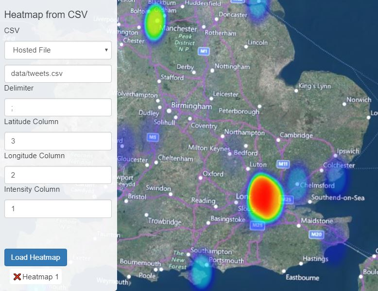
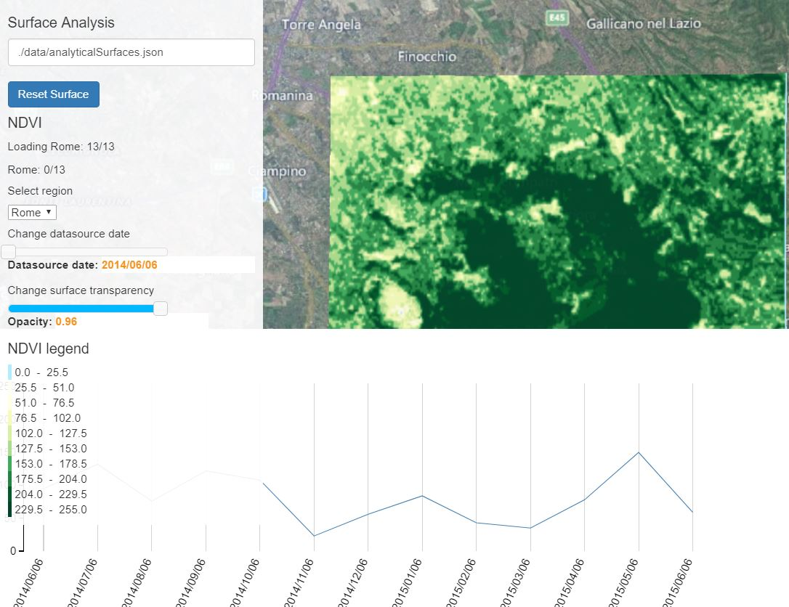

# MuViAS

MuViAS stands for Multidimensional Visualization and Analysis Suite

## Introduction
The idea behind this project is to create an application using Nasa Web World Wind to show metadata about environmental
 variables in more than three dimensions. The model implemented to present 3D data is a Voxel model. 
Each voxel has three dimensions that will be possible to customize with the interested metadata, but also more 
information can be shown thanks to Web WorldWind capabilities.   The color of each Voxel present a variable in the 
dataset and additionally creating an animation in time gives the opportunity to introduce a further variable. 
Users can interact with the visualization, customizing the variables to show on the Voxels and filtering data according 
to specific settings. 
This projects participate in the Google Summer of Code 2016.
More information about it can be found here
[OSGeo Wiki](https//wiki.osgeo.org/wiki/NASA_Web_WorldWind_Multidimension_Visualization_Tool_GSoC_2016)

The official website presenting the application can be found here [MuViAS](http://muvias.eoapps.eu/muvias/)

## Use the application
### Testing
* Browse to [MuViAS](http://muvias.eoapps.eu/muvias/)
* The application will start and a guide will walk you through the application
* A top menu is available with many importing features
 

### Features:
[CSV Doxels](#import-a-point-feature-csv-dataset) | [WMS](#import-a-wms-layer) | [Heatmap](#generate-heatmap) |
[Surface Analysis](#surface-analysis) | [GeoJSON](#geojson) |[GeoTIFF](#geotiff) | [KML](#kml) | 
[Surface Image](#surface-image) 
 
 
### Import a point feature CSV dataset
From the top menu, select the CSV Doxel option 
To import a dataset the application provides a 'select file' box that allows choosing a file in your computer and
importing it inside the application.
It is also possible to choose a file available online, inserting the link to the file location. 
The file should have a .CSV format and contain the following columns in any order:

| Latitude | Longitude | Time | Value |

After having selected the file, click on the Load Configuration button to select the appropriate kind of file 
(Georeferenced CSV).
Now the application, under the Georeferenced CSV menu, will show all the options to import the file correctly.

To customize the environment, from the dropdown menu, click on Advanced Options and select the required parameters.

#### Browse CSV data
When the data is successfully imported, it will be shown over the globe. You will see some doxels representing the data,
 in particular the color will represent the first selected variable.
The layers of time will be shown according to the time-step selected in the Advanced Options panel during the importing 
of the data.
From the left panel  you can use all the available filters, browse through the time, and customize many options.
To obtain information about a doxel, you can select from the top bar the Point Info selector and click on a doxel. 

A panel showing some statistics will appear on the bottom

To create some spatial cluster, you can instead click on the top bar, selecting the Big Doxels selector. Automatically
 the doxels will be grouped according to the group defined during the importing of the data. By default the color will 
 represent the weighted average.

### Import a WMS layer
From the top menu, select the WMS option 
It is now possible to insert the URL of a WMS server. After inserting one and clicking on the "Add Server" button,
a list of layer will appear in the menu below.
An example WMS layer has been already inserted by default.

### Generate Heatmap
From the top menu, select the Heatmap option 
You can now select a CSV to generate a heatmap. It can be hosted on a CORS accessible website or you can upload one 
from local.
After selecting the source you need to specify the delimiter of the CSV file (comma, column, slash, etc.),
The column representing the latitude and the longitude (in EPSG:4326) and optionally a column for the value.
After clicking on "Load Heatmap" the heatmap will be generated.
An example Heatmap has been already inserted by default.

### Surface Analysis
From the top menu, select the Surface Analysis option 
You can now select a json file containing analytical surfaces information. 
After clicking on "Load Surface" the images will be loaded.
It is now possible clicking on the image to obtain a trend graph of the selected pixel over time.
More options are available in the Surface Analysis tab.
An example Analysis Surface has been already inserted by default.

### GeoJSON
From the top menu, select the GeoJSON option 
You can now paste the content of a GeoJSON file or insert the link to download one.
After clicking on "Load GeoJSON" the file will be loaded.
An example GeoJSON has been already inserted by default.

### GeoTIFF
From the top menu, select the GeoTIFF option 
You can now select the URL of a GeoTIFF from a CORS enabled server. 
Keep in mind that if CORS in not enabled on the server you will not be able to retrieve the image.
After clicking on "Insert GeoTIFF" the image will be loaded and the view center over the image.
You can now zoom and view the file in the globe.
An example GeoTIFF has been already inserted by default.

### KML
From the top menu, select the KML option 
You can now select the URL of a KML or upload a new one.
After clicking on "Insert KML" the KML file will be shown in the globe.
An example KML has been already inserted by default.

### Surface Image
From the top menu, select the Image option 
You can now select the URL of an image.
You need to specify now the bounding box of the image (EPSG:4326) that will be wrapped to the terrain.
An example Image has been already inserted by default.
